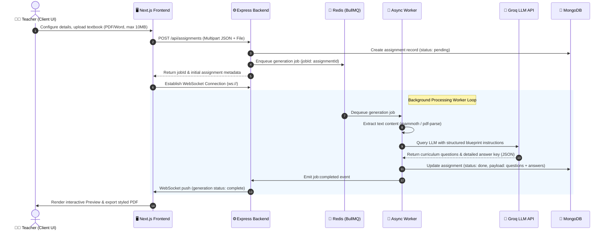

# 🌟 VedaAI — Enterprise-Grade AI-Powered Assessment Suite

[](https://nextjs.org/)
[](https://expressjs.com/)
[](https://www.mongodb.com/)
[](https://redis.io/)
[](https://www.typescriptlang.org/)
[](https://clerk.com/)
[](https://groq.com/)

**VedaAI** is a premium, curriculum-aligned, and intelligent assessment generation suite designed for modern educators and academic institutions. It empowers teachers to transform syllabus guidelines, chapters, textbook PDFs, or Word documents into fully structured exam papers, worksheets, and quizzes within seconds—complete with professional formatting, marking schemes, and answer keys.

---

## 🏗️ Architecture & Asynchronous Data Flow

VedaAI is architected around a decoupled, queue-backed, event-driven pattern. Heavy LLM reasoning and file parsing operations are offloaded to an asynchronous worker pool, ensuring the Express API gateway remains responsive under load.



---

## ⚡ Core Capabilities & Features

*   **📂 Intelligent Material Parser**: Seamlessly uploads and extracts reference content from NCERT/CBSE guidelines, chapters, or exam notes in PDF or Word formats.
*   **⚙️ Advanced Blueprint Configurator**: Allows setting customizable blueprints specifying section counts, type distributions (MCQs, Short/Long Answer, True/False, Fill in the blanks), and targets for marks per question.
*   **🤖 State-of-the-Art LLM Engine**: Leverages high-frequency, low-latency API connections to Groq's llama models using customized prompt parameters for strict curriculum alignment.
*   **🔄 Live WebSocket Progress Gateway**: Tracks generation states in real-time, feeding live job progress statuses right to the teacher's browser.
*   **📄 Printable Document Designer**: Generates professional, printable exam sheets on-the-fly via PDFKit, including school branding (CBSE code, branch, school name) headers.
*   **📚 Integrated Resource Library**: A central vault for materials and completed assessments, enforcing a **10MB upload limit** to protect processing stability.
*   **📱 Ultra-Premium Mobile Optimization**: Tailored layouts resolving key mobile web pitfalls such as double scrolling, touch event latency, and virtual keyboard layout shifts.

---

## 📁 Repository Tour

The monorepo structure separating the client and service layers is detailed below:

```
vedaAI/
├── backend/                       # Express REST API, WS Server & Asynchronous Worker
│   ├── src/
│   │   ├── config/                # Mongoose, Redis, Groq & Clerk SDK clients
│   │   ├── controllers/           # Route logic (assignments, library, users, notifications)
│   │   ├── middlewares/           # Clerk JWT auth & Multer upload middleware
│   │   ├── models/                # MongoDB schemas (Assignment, LibraryItem, User, Notification)
│   │   ├── queues/                # BullMQ queue instantiations & configuration
│   │   ├── routes/                # Express routing definitions
│   │   ├── services/              # Business logic (AI Prompts, PDF & Docx parser, PDFKit builder)
│   │   ├── websocket/             # WebSocket connections and event dispatchers
│   │   ├── workers/               # BullMQ background job processor
│   │   ├── seed.ts                # Sandbox database mock seeder script
│   │   ├── app.ts                 # Express app definition & middleware pipelines
│   │   ├── server.ts              # Entry point (HTTP + WebSocket server listener)
│   │   └── types.d.ts             # Custom global TypeScript definitions
│   ├── package.json
│   └── tsconfig.json
│
└── frontend/                      # Next.js 14 App Router User Interface
    ├── src/
    │   ├── app/                   # App Router views (home, assignments, create, result, status, settings)
    │   ├── components/            # Interface elements (layout, create steps, results, shared alerts)
    │   │   ├── layout/            # Sidebar, TopBar, MobileBottomNav, AppShell wrapper
    │   │   ├── create/            # Multi-step forms, datepickers, file dropzones
    │   │   ├── result/            # Exam preview grids, printable sheets
    │   │   └── shared/            # Toast systems, modal dialogs
    │   ├── hooks/                 # WebSocket listeners and React state custom hooks
    │   ├── lib/                   # API clients and validation scripts
    │   ├── store/                 # Zustand states (forms, toast, profile, jobs, etc.)
    │   └── types/                 # Frontend interfaces and data schemas
    ├── package.json
    └── tailwind.config.ts
```

---

## ⚙️ Environment Configurations

Create the configuration files in their respective folders before booting the servers.

### 🔌 Backend configuration (`backend/.env`)

```env
PORT=4000
MONGODB_URI=mongodb+srv://<username>:<password>@<cluster>.mongodb.net/vedaai?retryWrites=true&w=majority
REDIS_URL=redis://localhost:6379
GROQ_API_KEY=gsk_your_groq_api_key_here
```

### 💻 Frontend configuration (`frontend/.env.local`)

```env
# Clerk Authentication Configuration
NEXT_PUBLIC_CLERK_PUBLISHABLE_KEY=pk_test_your_clerk_pub_key
CLERK_SECRET_KEY=sk_test_your_clerk_secret_key
NEXT_PUBLIC_CLERK_SIGN_IN_URL=/sign-in
NEXT_PUBLIC_CLERK_SIGN_UP_URL=/sign-up
NEXT_PUBLIC_CLERK_SIGN_IN_FALLBACK_REDIRECT_URL=/
NEXT_PUBLIC_CLERK_SIGN_UP_FALLBACK_REDIRECT_URL=/

# Backend API & WebSocket Connections
NEXT_PUBLIC_API_URL=http://localhost:4000/api
NEXT_PUBLIC_WS_URL=ws://localhost:4000
```

---

## 🚀 Getting Started & Local Installation

### Prerequisites

*   **Node.js**: v18.x or v20.x
*   **MongoDB**: Run a local daemon or obtain a MongoDB Atlas Connection String
*   **Redis**: BullMQ relies on a Redis server (port `6379`). Ensure the Redis instance is running locally or in Docker.
*   **Groq API Key**: Create one at [console.groq.com](https://console.groq.com)

### Installation Steps

1.  **Clone the project**:
    ```bash
    git clone https://github.com/shivengoomer/vedaAI-assigment.git
    cd vedaAI
    ```

2.  **Spin Up the Backend**:
    ```bash
    cd backend
    npm install
    # (Optional) Populate MongoDB with dummy library items & assignments
    npm run seed
    # Launch in hot-reload development mode
    npm run dev
    ```

3.  **Spin Up the Frontend**:
    ```bash
    # Open a new terminal tab
    cd frontend
    npm install
    # Launch Next.js dev server
    npm run dev
    ```
    Visit the app in your browser at `http://localhost:3000` (or `3001` if port 3000 is occupied).

---

## 🛠️ Compilation & Production Builds

Ensure TypeScript compiler checks pass, and package for production deployment.

### Backend Compilation
```bash
cd backend
npm run build
npm start
```

### Frontend Optimization
```bash
cd frontend
npm run build
npm start
```

---

## 📜 License & Acknowledgments

This project was built for educators to bridge the gap between curriculum guidelines and student assessments.
For inquiries, please contact the repository administrator.
